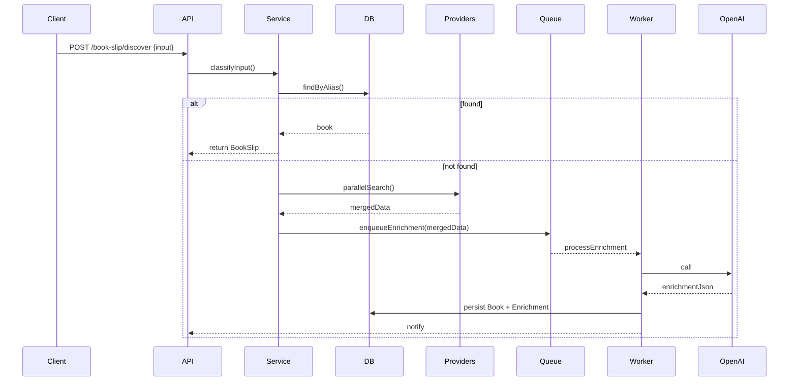

# BookSlip Architecture & Developer Guide

## One-line Summary
The BookSlip module ingests user-provided identifiers or free-text, resolves canonical book metadata from multiple providers, deduplicates and persists canonical records, enriches them via an LLM with Spicebound-specific taxonomy, and returns a single, frontend-ready "Book Slip" object.

---

## System Summary

- Framework: NestJS (TypeScript)
- Database: PostgreSQL (via Prisma)
- LLM: OpenAI (configured via `src/config/openai.config.ts`)
- Billing / Payments: Stripe
- External sources: Google Books, Open Library, Amazon/Bookshop affiliate links
- Background processing: queue/worker pattern (e.g., BullMQ/Redis or a lightweight worker process)

---

## Overall Flow (high-level)

1. Client POSTs to `POST /book-slip/discover` with either a URL, ISBN/ASIN, or plain title/author text.
2. Controller accepts request and performs schema validation and auth checks.
3. Input is classified (URL vs text) and normalized into candidate identifiers.
4. Quick local lookup by exact ID (ISBN/ASIN) returns cached canonical Book if present.
5. If not found, provider searches run in parallel (Google Books, Open Library). Results are merged.
6. A deduplication step tries to match merged metadata against existing DB records by normalized title/author/fuzzy ISBN match.
7. If still unmatched, an AI enrichment job is executed (synchronously for small requests or enqueued for heavier ones), which classifies and augments metadata (spice score, tropes, age level, subgenre tags).
8. Persist as a canonical `Book` record and `BookAlias` rows for all canonical identifiers discovered.
9. Construct `BookSlipResponse` with canonical data, vendor links, and enrichment fields, then return to client.

---

## Detailed Pipeline (components & responsibilities)

- `BookSlipController` (`src/main/book-slip/book-slip.controller.ts`)
	- Endpoint: `POST /book-slip/discover`
	- Validates input DTOs and delegates to `BookSlipService`.

- `BookSlipService` (`src/main/book-slip/book-slip.service.ts`)
	- Orchestrates the pipeline: detection, provider fetch, merge, dedupe, enrichment, persist, response.
	- Uses transactions for multi-row writes (Prisma transaction blocks).

- Providers (`src/main/book-slip/providers/`)
	- `google-books.provider.ts` — search and fetch by ISBN / title
	- `open-library.provider.ts` — fallback and description enrichment
	- Providers should be resilient: timeouts, retries with backoff, and result normalization.

- AI Enrichment (`src/main/book-slip/ai/ai-enrichment.service.ts`)
	- Sends a tightly-scoped system prompt and schema to the LLM, asking for strict JSON output.
	- Validates/parses outputs with a JSON schema and defensive parsing to avoid injection or hallucination.
	- Fields returned: `spice_rating` (0-6), `age_level` (e.g., "Adult"), `tropes` (array), `subgenres` (array), `safety_flags` (array), `confidence_scores` (optional).

- Utilities (`src/main/book-slip/utils/`)
	- `input-detector.ts`, `url-normalizer.ts`, `merge-book-data.ts`, `link-generator.ts`, and fuzzy matching helpers.

- Persistence (`prisma/schema.prisma` and `src/main/prisma`)
	- Core tables: `Book`, `BookAlias`, `BookEnrichment`, `User`, `BookSlipActivity`.

---

## API Definition (core endpoints)

- POST `/book-slip/discover`
	- Body: { input: string }
	- Responses:
		- 200: `{ bookSlip: BookSlipResponse }` if resolved synchronously
		- 202: `{ jobId: string }` if enrichment is enqueued and will complete asynchronously
		- 400/422: validation errors

- GET `/book-slip/:id` — returns canonical `BookSlipResponse` by internal ID
- POST `/book-slip/enrich/:id` — re-run enrichment for a canonical book

Example request:

```json
{ "input": "https://openlibrary.org/works/OL12345W" }
```

Example canonical `BookSlipResponse` (trimmed):

```json
{
	"id": "book_abc123",
	"title": "Fourth Wing",
	"author": "Rebecca Yarros",
	"isbn13": "978125078xxxx",
	"spice_rating": 5,
	"tropes": ["Enemies to Lovers","Found Family"],
	"subgenres": ["Romantic Fantasy"],
	"links": { "amazon": "https://amzn.to/..", "bookshop": "https://bookshop.org/.." }
}
```

---

## Data Model Notes (Prisma excerpts)

- `Book`
	- id (uuid), title, subtitle, authors (string[]), description, isbn10, isbn13, publishedAt, publisher, coverUrl, canonicalSlug

- `BookAlias`
	- id, bookId -> Book.id, aliasType (ISBN/ASIN/GOOGLE_ID/OPENLIB_ID), aliasValue

- `BookEnrichment`
	- id, bookId, spiceRating, tropes (string[]), subgenres (string[]), rawAiResponse (json), enrichedAt

Design ideas:
- Ensure `BookAlias` has unique index on `(aliasType, aliasValue)` for O(1) lookup.
- Use lower-cased, normalized `canonicalSlug` for deterministic URL generation.

---

## AI: Prompts, Schema, and Safety

- System prompt pattern (summary):
	- Provide a strict JSON schema and an explicit list of allowed values for taxonomy fields.
	- Instruct the model: "Return ONLY valid JSON that conforms to the schema. If data is missing, return null or an empty array. Do not add fields outside the schema."

- Example minimal schema (for post-LLM validation):

```json
{
	"type": "object",
	"properties": {
		"spice_rating": {"type":"integer","minimum":0,"maximum":6},
		"age_level": {"type":"string"},
		"tropes": {"type":"array","items":{"type":"string"}},
		"subgenres": {"type":"array","items":{"type":"string"}},
		"safety_flags": {"type":"array","items":{"type":"string"}}
	},
	"required": ["spice_rating"]
}
```

- Robustness:
	- Always validate with a JSON schema after parsing.
	- Use a short-context prompt with clear examples to reduce hallucination.
	- On parse/validation failure, fall back to conservative defaults (e.g., `spice_rating: 0`) and enqueue a manual review.

---

## Deduplication Strategies

- Exact ID lookups via `BookAlias` (fast path).
- Normalized title + primary author fuzzy matching (Levenshtein or trigram index in Postgres) with conservative thresholds.
- ISBN normalization: strip non-digits, verify checksum when possible, prefer ISBN-13 over ISBN-10.
- For ambiguous matches, return potential matches to the client to choose from (UI-assisted deduplication).

---

## Background Jobs & Asynchronous Processing

- Use a job queue (Redis + BullMQ) or a small worker process pattern.
- Jobs:
	- `EnrichmentJob`: run AI enrichment, validate, persist `BookEnrichment`.
	- `ExternalFetchJob`: re-fetch metadata and update canonical Book
	- `LinkGenerationJob`: periodically refresh affiliate links

- Reliability:
	- Implement idempotency keys and dedupe job scheduling.
	- Retry on transient errors with exponential backoff; move to DLQ after N failures and create a `BookSlipActivity` log for manual inspection.

---

## Observability & Metrics

- Logs: structured JSON logs with `requestId`, `userId`, `bookId`, and `correlationId`.
- Metrics: instrument durations for provider calls, enrichment latency, queue length, and error rates.
- Health checks: readiness and liveness endpoints.

---

## Testing Strategy

- Unit tests: utils (`url-normalizer`, `merge-book-data`), provider adapters (mock HTTP), LLM parsing logic.
- Integration tests: local DB (SQLite in-memory) + mocked provider responses.
- E2E: simulate `POST /book-slip/discover` flows with recorded provider fixtures.

---

## Security & Rate Limiting

- Rate limit `POST /book-slip/discover` per IP and per user to avoid abuse of external APIs and LLM costs.
- Sanitize any HTML returned from providers before storing or returning to the frontend.
- Protect LLM keys and provider credentials via environment variables and a secrets manager.

---

## Deployment & Scaling

- Stateless app instances behind Caddy; scale horizontally. Use connection pooling and set Prisma `connection_limit` appropriately.
- Offload enrichment to workers to keep API latency low.
- Cache frequent lookups by ISBN using Redis with TTL based on observed update patterns.

---

## Developer Notes & Where to Look

- Controller / service: `src/main/book-slip/book-slip.controller.ts`, `src/main/book-slip/book-slip.service.ts`
- AI service: `src/main/book-slip/ai/ai-enrichment.service.ts`
- Providers: `src/main/book-slip/providers/*`
- Utils: `src/main/book-slip/utils/*`
- Types & DTOs: `src/main/book-slip/dto/*`, `src/main/book-slip/types/*`
- Prisma schema: `prisma/schema.prisma`

---

## Example Mermaid Sequence (optional)

If you'd like diagrams, I can add a Mermaid component/sequence diagram for the flows. Example snippet:



---

If you want, I will:
- Add the Mermaid diagrams directly into this file.
- Produce a compact `BOOK_SLIP_API.md` with endpoint examples and mocked responses.
- Draft the LLM system prompt and sample JSON outputs for the `ai-enrichment.service.ts` implementation.

Tell me which of the three you'd like next.

